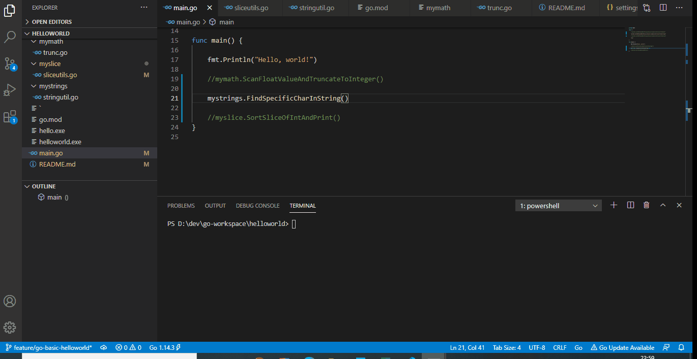

# go-basics-examples
This is a "Go" basic programming examples.

###  go version go1.14.3 windows/amd64

### VS Code version 1.52.1

## Project solves below assignments

## Assignment 1
   Write a program which prompts the user to enter a floating point number and
	prints the integer which is a truncated version of the floating point number that was entered.

   [trunc.go](https://github.com/BeTheCodeWithYou/go-basics-examples/blob/feature/go-basic-helloworld/internal/pkg/utils/mymath/trunc.go)

   #### Demo
   

## Assignment 2
   Write a program which prompts the user to enter a string. 
   The program searches through the entered string for the characters ‘i’, ‘a’, and ‘n’. 
   The program should print “Found!” if the entered string starts with the character ‘i’, 
   ends with the character ‘n’, and contains the character ‘a’. The program should print “Not Found!” otherwise. 
   The program should not be case-sensitive, so it does not matter if the characters are upper-case or lower-case.

   [stringutils.go](https://github.com/BeTheCodeWithYou/go-basics-examples/blob/feature/go-basic-helloworld/internal/pkg/utils/mystrings/stringutil.go)

   ## Demo
   
   
   
## Assignment 3
Write a program which prompts the user to enter integers and stores the integers in a sorted slice.
   The program should be written as a loop. Before entering the loop, the program should create an empty integer slice of size (length) 3.
   During each pass through the loop, the program prompts the user to enter an integer to be added to the slice.
   The program adds the integer to the slice, sorts the slice, and prints the contents of the slice in sorted order.
   The slice must grow in size to accommodate any number of integers which the user decides to enter.
   The program should only quit (exiting the loop) when the user enters the character ‘X’ instead of an integer.

   [sliceutils.go](https://github.com/BeTheCodeWithYou/go-basics-examples/blob/feature/go-basic-helloworld/internal/pkg/utils/myslice/sliceutils.go)

   ## Demo
   

   ## Assignment 4

   Write a program which prompts the user to first enter a name, and then enter an address. 
   Your program should create a map and add the name and address to the map using the keys “name” and “address”, respectively. 
   Your program should use Marshal() to create a JSON object from the map, and then your program should print the JSON object.

   [maputils.go](https://github.com/BeTheCodeWithYou/go-basics-examples/blob/feature/go-basic-helloworld/internal/pkg/utils/mymap/maputils.go)

   ## Assignment 5
   
   Write a program which reads information from a file and represents it in a slice of structs.
Assume that there is a text file which contains a series of names. Each line of the text file
has a first name and a last name, in that order, separated by a single space on the line.

Your program will define a name struct which has two fields, fname for the first name, and
lname for the last name. Each field will be a string of size 20 (characters).

Your program should prompt the user for the name of the text file. Your program will successively
read each line of the text file and create a struct which contains the first and last names found
in the file. Each struct created will be added to a slice, and after all lines have been read from
the file, your program will have a slice containing one struct for each line in the file.

After reading all lines from the file, your program should iterate through your slice of structs and
print the first and last names found in each struct.

[fileutils.go](https://github.com/BeTheCodeWithYou/go-basics-examples/blob/feature/go-basic-helloworld/internal/pkg/utils/myfiles/fileutils.go)

### running the app
go run main.go

